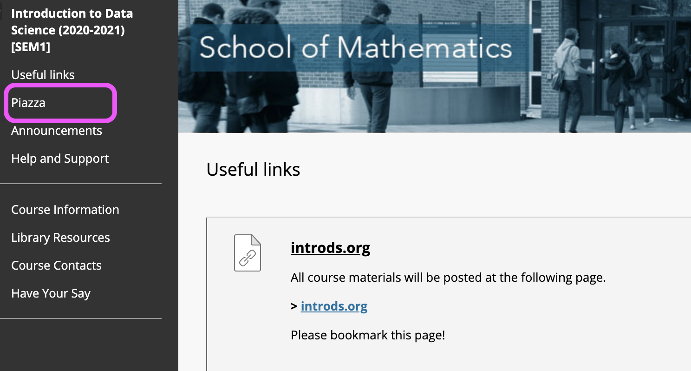
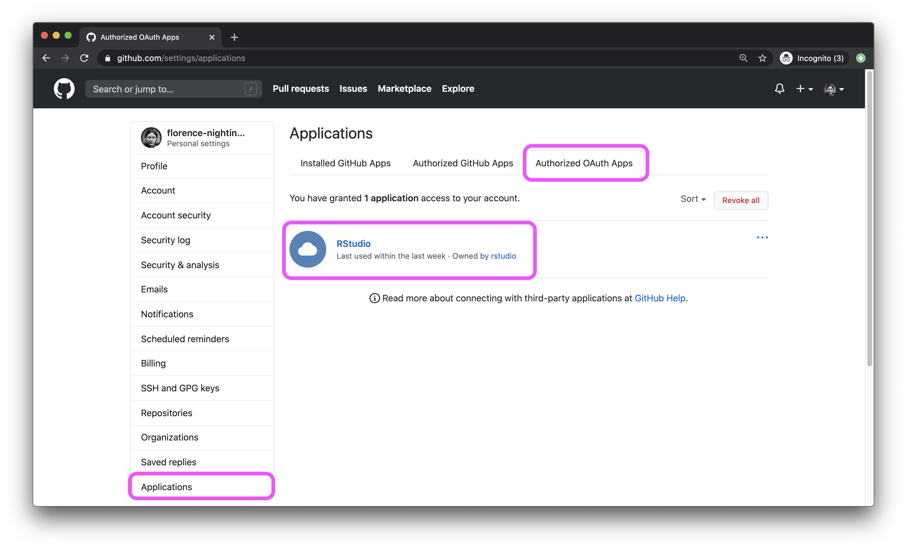

Below are the tasks we will be working through in today's workshop. The primary goal in all of this is to go through a shakedown process for some of the core technology we will be using in this course.

Each workshop Zoom session will start with a brief introduction in the "big group" and then we will move everyone into breakout rooms in small teams. For this week the teams will be randomly assigned. 

1. Once in the breakout room everyone should turn on their audio and video (if possible).

2. Take turns introducing yourselves (e.g. your name, where you are currently, where you studied previously, etc.).

3. After each person in the group has had a turn, everyone should provide constructive feedback on any audio or video difficulties encountered

```{r rstudio-cloud, fig.margin = TRUE, echo = FALSE}
knitr::include_graphics("img/rstudio-cloud.png")
```

4. (If you haven't yet done so...) Go to Learn and click on the **Join RStudio Cloud** link to sign up for a free RStudio Cloud account which will be automatically enrolled in our course's space. Feel free to try launching a project and exploring.

5. Each participant should now take turns to briefly share their screen, we recommend sharing your browser window with RStudio Cloud open. Provide feedback to one another about the quality of the share, pay particular mind to whether or not things like text are readable.

6. Use the **Ask for help** button within Zoom and see if a tutor shows up, feel free to move on while you wait.

```{r piazza, fig.margin = TRUE, echo = FALSE}

```

7. Go to Learn and click on the **Piazza** link on the left to activate your Piazza account. Read my post titled "Welcome to Piazza!" there. 

<br><br>

7. Complete the Getting to know you survey [here](https://forms.office.com/Pages/ResponsePage.aspx?id=sAafLmkWiUWHiRCgaTTcYRiRHjHRDWhOuLE_6JyNA0dUMkU3TzFXRTkyTFBVVjBLVUVTRDdJVlg2WS4u). One of the questions on the survey asks you about your GitHub username. If you haven't yet created one, see [here](https://happygitwithr.com/github-acct.html) for advice on selecting a user name and see the video titled *Meet the toolkit: version control and collaboration* [here](https://www.introds.org/post/01-week/#videos) for step-by-step instructions.

8. Check your email and accept the invitation to join the GitHub organization for this course. If you already have accepted it, move on to the next step. If you have not yet accepted it, message me on Teams to let me know and I'll send the invite. You need to accept the invitation before moving on to the next step.

9. Connect your RStudio and GitHub accounts by following the steps below.

- Click on your name on the top right corner to open the right menu.
- Then, click on Authentication.

```{r github-auth-1, echo = FALSE}
knitr::include_graphics("img/github-auth-1.png")
```

- In the Authentication window, check the box for *Enabled*.

```{r github-auth-2, echo = FALSE}
knitr::include_graphics("img/github-auth-2.png")
```

- In the next window, click on the green box that says "Authorize rstudio".

```{r github-auth-3, echo = FALSE}
knitr::include_graphics("img/github-auth-3.png")
```

- Back in the Authentication window, check the box for *Private repo access also enabled*, and once again, on the green box that says "Authorize rstudio" in the next window. At this point you should also make sure that the course organization shows up for you under *Organization access*. If it does not, this means you have not yet accepted the GitHub invitation to join the course, and you should go back and do that.

```{r github-auth-4, echo = FALSE}
knitr::include_graphics("img/github-auth-4.png")
```

- Once you're done, both of these boxes should be checked.

```{r github-auth-5, echo = FALSE}
knitr::include_graphics("img/github-auth-5.png")
```

- To confirm that you've successfully linked up your GitHub and RStudio Cloud accounts, [GitHub settings > Applications](https://github.com/settings/applications). You should see RStudio listed as an authorized app under *Authorized OAuth Apps*. If you don't this is a good time to ask a question (by calling a tutor if during the workshop or asking on Piazza).

```{r github-auth-6, echo = FALSE}

```

Once you're done with these steps, you're done with Lab 00! You do not need to turn in anything for this lab. However, note that you must have completed all of these steps before you can start on your homework assignment.
