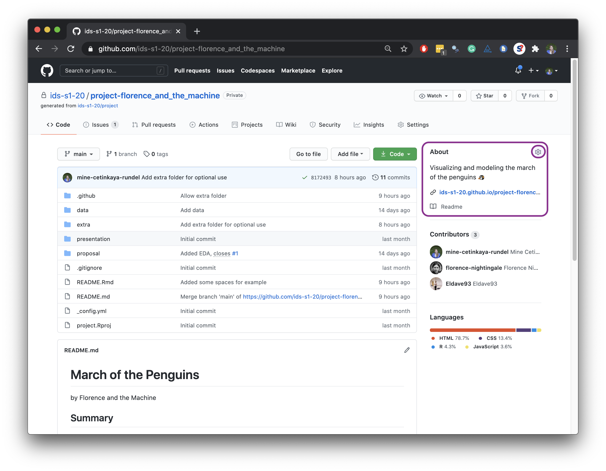

```{r setup, include=FALSE}
knitr::opts_chunk$set(echo = TRUE)
```

This week you'll be working on your projects.
This means no separate `lab-07` repo for your lab, everything goes in your project repo.
Your lab score will be based on having completed these steps and, as usual, individual contributions to the project repo for these particular tasks.

Once you complete these, use the rest of the time to, well, work on your project!
Remember, your project assignment is [here](https://www.introds.org/#project).

If you haven't yet done so (I know some team members have not!) go to the course organization on GitHub and clone your project repo titled `project-TEAM_NAME`

## README

Add your project title and team name to the `README.Rmd` file in the repo.
Knit, commit, and push your changes to `README.Rmd` and `README.md`.
Observe that these are updated in the README of the repo.

## Slides

-   Open the `presentation.Rmd` file in the `presentation` folder, knit the document, and review the presentation format. This is where your presentation will go. Update the YAML with your project title, team name, etc. and commit and push your changes.

```{marginfigure}
Remember that your data lives in a folder called data that is not inside your presentation folder. So you need to specify the path to your data with here::here("data/name_of_datafile") in your read_csv() (or similar) function.
```

-   Load your data in your `presentation.Rmd`, knit, and make sure everything works. Commit and push your updated proposal to your project repo.

## ghpages

-   Go to your project repo on GitHub, click on **Settings** on the top right corner, and scroll down to the section titled **GiHub Pages**. Under **Source**, select `main` branch and the `root` folder. This will give you a URL where the website for your project will be automatically built from the content in your README. This might take a few minutes. Click on the link to confirm that the website has been built. Once the website is built, pull changes to your project.

```{marginfigure}
This website is public, but your repository will remain private, unless… you as a team decide you would like to feature your repos in your personal GitHub profiles. If so, I will help you convert your repo to a public repo at the end of the semester.
```

-   You can see how a project repo website looks [here](https://ids-s1-20.github.io/project-florence_and_the_machine/). Click on the link in the presentation section and you should be able to view the rendered slides. This is the link we will use to for your slides during the presentations (if you choose to present "live", more on this below...).
-   *(Optional)* Edit the `_config.yml` document to change the theme of your project website. Your options are [architect](https://pages-themes.github.io/architect), [cayman](https://pages-themes.github.io/cayman), [dinky](https://pages-themes.github.io/dinky), [hacker](https://pages-themes.github.io/hacker), [leap-day](https://pages-themes.github.io/leap-day), [merlot](https://pages-themes.github.io/merlot), [midnight](https://pages-themes.github.io/midnight), [minima](https://pages-themes.github.io/minima), [minimal](https://pages-themes.github.io/minimal), [modernist](https://pages-themes.github.io/modernist), [slate](https://pages-themes.github.io/slate), [tactile](https://pages-themes.github.io/tactile), and [time-machine](https://pages-themes.github.io/time-machine). Suppose you want the `architect` theme, you'd add `theme: architect` to the `_config.yml` document, save, commit, and push.

```{r fig.margin=TRUE, out.width = "100%", echo=FALSE}

```

-   Click on the gear icon next to **About** and add a very brief description of your project and the URL of your project website.

## Planning

Now that all the logistical details are done, start work on the planning of your project.

-   Discuss next steps for your project, identifying concrete tasks that need to be done. Assign at least one task to each member.

```{marginfigure}
When done, close the issue with the relevant commit. You can do this by prefacing your commits with “Fixes”, “Fixed”, “Fix”, “Closes”, “Closed”, or “Close” and then the number of the issue followed by a hashtag (e.g. `Fixes #2`). The issue will be closed when you push the changes to your repo.
```

-   Each member should then open an issue on the repo with their task, and assign it to themselves. Include as much detail as possible to make sure you remember your discussion.
-   Fill out this form (link to be posted) to help with presentation scheduling. **Only one response per team!**
-   **Strongly recommended:** Get a hold of a tutor and run your ideas by them.

## Presentations

You have two options for presenting: live during the workshop on Zoom or submitting a pre-recorded video.
Logistically, the live presentation might be easier (you show up, give your 5 minute presentation as a team, listen to the presentations of others in your workshop group, and carry on!).
But some of you might choose to not do a live presentation if you have geographically distributed members on the team, potentially with tricky internet setup.
If so, you might want to pre-record your presentation and submit the video.
You can find instructions for pre-recording your presentations [here](https://docs.google.com/document/d/1FxpFqUbEVpOzp7PWICC8gEvmIKfsNPT3mmQuSufsGHQ/edit?usp=sharing).
Discuss as a team which you prefer and submit your preference on the form [here](https://forms.office.com/Pages/ResponsePage.aspx?id=sAafLmkWiUWHiRCgaTTcYRiRHjHRDWhOuLE_6JyNA0dUOEtKMEE4NUc1TFRZOTZIVEVDWUZJSkVBQi4u).
